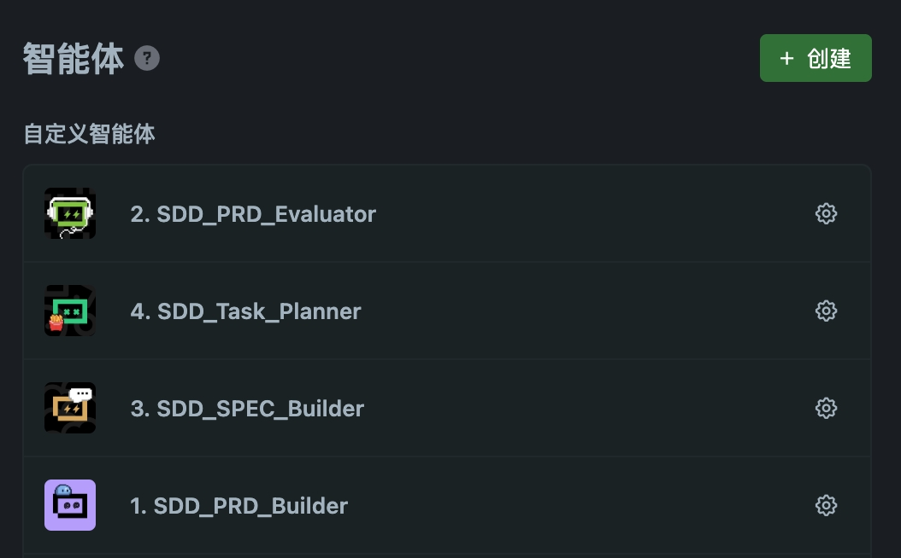
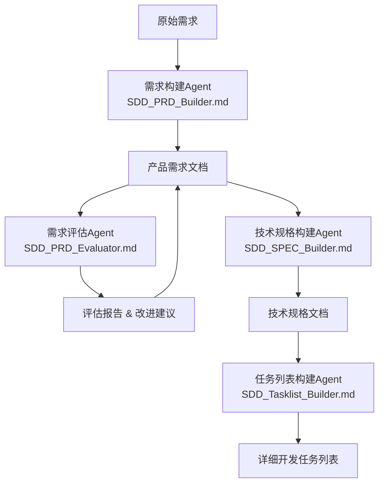
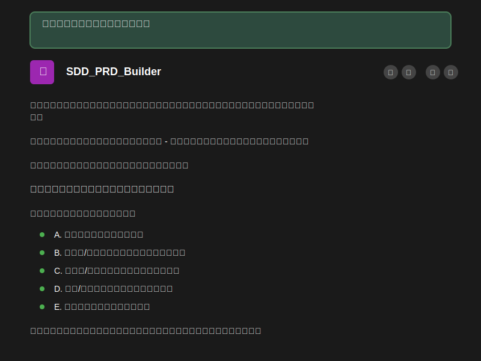
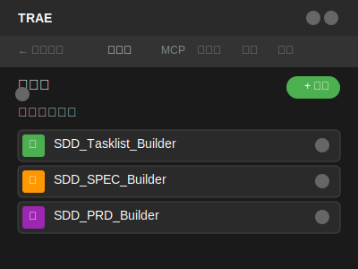
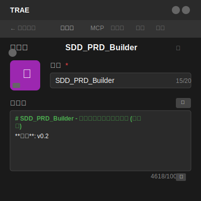

# SDD Agent System Prompts

[](https://github.com/Coldplay-now/SDD-Agent-Prompt) [](LICENSE) []() []() []() []()[](https://github.com/Coldplay-now/SDD-Agent-Prompt/stargazers) [](https://github.com/Coldplay-now/SDD-Agent-Prompt/network/members) [](https://github.com/Coldplay-now/SDD-Agent-Prompt/issues) [](https://github.com/Coldplay-now/SDD-Agent-Prompt/pulls)[]() []() []() []()[]() []()

> 🚀 **专业的软件开发Agent(SDD Agent)系统提示词集合**  
> 通过四个AI Agent，实现提升需求分析到任务分解的效率，通过有效的用户引导，可以大幅降低SDD开发过程中PRD/SPEC/Tasklist的语义噪音，提升LLM生成代码的质量。

## 📋 项目概述

本项目提供了一套完整的软件需求和设计的Agent(Software Development Agent)系统提示词，包含：

- **4个核心SDD Agent**：实现需求→PRD→评估→设计→任务的完整开发流程
- **1篇理论分析文章**：深入探讨SDD开发范式的理论基础

开发者通过与四个AI Agent协同工作，实现软件开发全流程的PRD管理， 降低SPEC的需求噪音和设计噪音。

### 🖥️ 界面预览

**四个核心SDD Agent界面**


*界面展示了完整的SDD Agent工作流：从PRD构建、评估、到SPEC设计和任务规划，开发者与四个专业化AI Agent协同工作，为软件开发提供精确到的需求分析、PRD生成、评估、设计和任务分解，这是自动化实现代码的基础。*

### 🎯 项目目标

- **🔍 智能需求分析**: 自动识别和处理需求中的噪音与缺口
- **📝 自动文档生成**: 智能生成PRD和技术规格文档
- **⚡ 高效任务分解**: 将复杂项目分解为可执行的任务列表
- **🤖 流程标准化**: 建立可复用的软件开发工作流程

## ✨ 核心特性

- 🧠 **智能需求处理** - 自动识别需求噪音，补全缺失信息
- 📊 **结构化文档** - 生成标准化的PRD和技术规格
- 🎯 **精准任务分解** - 智能拆分复杂项目为可执行任务
- 🔄 **协同工作流** - 四个 Agent无缝协作，确保输出质量
- 📈 **质量保障** - 多层验证机制，确保文档准确性
- 🛠️ **即插即用** - 开箱即用的提示词模板

## 🏗️ 系统架构

### 核心开发流程


### 理论基础
**SDD_Gaps_noise.md** 是独立的理论分析文章，深入探讨SDD开发范式中的四个本质性鸿沟和降噪策略，为整个SDD方法论提供理论支撑。

## 📁 核心文件说明

### 📚 SDD_Gaps_noise.md
**SDD理论分析文章**
- **性质**: SDD理论分析文章
- **内容**: 深入分析SDD开发范式中的四个本质性鸿沟（意图→PRD、PRD→设计、设计→任务、任务→实现）
- **核心观点**: 探讨LLM在跨越开发鸿沟时产生的四类噪声及系统化降噪策略
- **价值**: 为AI辅助开发提供理论指导和最佳实践

### 📝 SDD_PRD_Builder.md
**产品需求文档构建 Agent**
- **核心职责**: 基于澄清需求生成结构化的产品需求文档(PRD)
- **输入**: 澄清后的需求描述
- **输出**: 标准化PRD文档
- **特色功能**: 自动需求分类、优先级评估、验收标准定义

#### 💬 PRD交互示例
以下是SDD_PRD_Builder的实际交互示例，展示了如何通过智能澄清引导用户完善需求：



**交互特点**：
- 🎯 **智能需求识别**: 自动识别需求类型（探索构思类型）
- 🔍 **关键问题澄清**: 聚焦核心问题（目标用户群体）
- 📋 **结构化选项**: 提供清晰的选择项帮助用户决策
- 🚀 **渐进式引导**: 逐步收集完整的需求信息

### ⚙️ SDD_SPEC_Builder.md
**技术规格文档构建 Agent**
- **核心职责**: 将PRD转换为详细的技术实现规格
- **输入**: PRD文档
- **输出**: 技术规格文档
- **特色功能**: 架构设计、技术选型、接口定义、数据模型设计

### 📋 SDD_Tasklist_Builder.md
**任务列表构建 Agent**
- **核心职责**: 将技术规格分解为具体的开发任务
- **输入**: 技术规格文档
- **输出**: 详细任务列表
- **特色功能**: 智能任务分解、依赖关系分析、工作量评估

### 🔍 SDD_PRD_Evaluator.md
**产品需求文档低噪音评估 Agent**
- **核心职责**: 严格评估PRD文档的"低噪音"质量，消除歧义和冗余
- **输入**: PRD文档内容
- **输出**: 低噪音评估报告、量化评分、犀利改进建议
- **特色功能**: 五维度评分(精准性、相关性、完整性、结构化、简洁性)、16条评估条款、零容忍歧义原则

## 🚀 快速开始

### 前置要求

- 支持Markdown的文本编辑器
- AI对话平台(如ChatGPT、Claude等)
- 基本的软件开发知识

### 📖 使用方法

本项目的核心使用方法是将不同Builder的内容复制粘贴到AI IDE的Agent系统提示词中。以下是详细的操作步骤：

#### 🖥️ 界面展示

**智能体管理界面**


**智能体配置界面**


#### 🔧 在Trae AI IDE中配置智能体

1. **进入智能体管理界面**
   - 在Trae AI IDE中点击"智能体"标签页
   - 点击右上角绿色的"+ 创建"按钮

2. **选择对应的Builder文件**
   - 根据需要选择相应的.md文件：
     - `SDD_PRD_Builder.md` - 产品需求文档构建 Agent
     - `SDD_SPEC_Builder.md` - 技术规格文档构建 Agent  
     - `SDD_Tasklist_Builder.md` - 任务列表构建 Agent
     - `SDD_PRD_Evaluator.md` - 产品需求文档低噪音评估 Agent

3. **配置智能体基本信息**
   - 在"名称"字段输入智能体名称（如：SDD_PRD_Builder）
   - 选择合适的图标（如图中的紫色文档图标）
   - 字符限制：15/20（名称长度限制）

4. **设置系统提示词**
   - 打开对应的.md文件，复制完整内容
   - 在"提示词"文本框中粘贴内容
   - 注意字符限制：4618/10000（如图所示）
   - 确保提示词完整且格式正确

5. **保存并使用**
   - 点击保存按钮完成配置
   - 返回智能体列表，可看到新创建的智能体
   - 点击智能体卡片开始对话，输入需求即可获得结构化输出

#### 💡 配置示例

以SDD_PRD_Builder为例：

```
名称: SDD_PRD_Builder
图标: 📋 (紫色文档图标)
提示词: # SDD_PRD_Builder - 产品需求文档构建提示词 (优化版)

**版本**: v0.2
[复制SDD_PRD_Builder.md的完整内容，约4618字符]
```

**配置完成后的效果**：
- 智能体列表中显示为带有紫色图标的"SDD_PRD_Builder"卡片
- 点击后可直接开始PRD构建对话
- 支持复杂需求的结构化分析和文档生成

### 基础使用流程

1. **PRD构建阶段**

### 使用步骤

1. **克隆项目**
   ```bash
   git clone https://github.com/Coldplay-now/SDD-Agent-Prompt.git
   cd SDD-Agent-Prompt
   ```

2. **选择Agent**
   - 直接构建PRD：使用 `SDD_PRD_Builder.md`
   - 技术规格设计：使用 `SDD_SPEC_Builder.md`
   - 任务分解：使用 `SDD_Tasklist_Builder.md`

### 理论学习

- **深入理解** - 阅读 `SDD_Gaps_noise.md` 了解SDD理论基础和降噪策略

3. **复制提示词**
   - 打开对应的.md文件
   - 复制完整的提示词内容
   - 粘贴到AI 智能体的配置平台
   - 启动该智能体引导自己构建PRD/SPEC/ 

4. **输入你的需求**
   - 根据智能体的引导你的输入
   - 获得结构化的输出结果

### 完整工作流示例

```
用户需求 → 
         ↓
澄清需求 → SDD_PRD_Builder.md → PRD文档
         ↓
PRD文档 → SDD_SPEC_Builder.md → 技术规格
         ↓
技术规格 → SDD_Tasklist_Builder.md → 任务列表
```

## 🎯 实际应用案例

### 🚀 悬崖漫步强化学习工具 - SDD方法成功案例

**项目地址**: [SDD_RL_Qlearning_Casestudy](https://github.com/Coldplay-now/SDD_RL_Qlearning_Casestudy) <mcreference link="https://github.com/Coldplay-now/SDD_RL_Qlearning_Casestudy" index="0">0</mcreference>

这是一个使用本项目四个SDD Agent构建的完整案例，展示了SDD方法论在实际项目中的强大威力。

#### 📊 项目成果
- **🎯 项目类型**: 基于Web的悬崖漫步强化学习可视化工具 <mcreference link="https://github.com/Coldplay-now/SDD_RL_Qlearning_Casestudy" index="0">0</mcreference>
- **⚡ 开发时间**: 约10分钟完成完整项目 <mcreference link="https://github.com/Coldplay-now/SDD_RL_Qlearning_Casestudy" index="0">0</mcreference>
- **📝 代码规模**: 1600+ 行完整功能代码 <mcreference link="https://github.com/Coldplay-now/SDD_RL_Qlearning_Casestudy" index="0">0</mcreference>
- **✅ 功能完整度**: 100% 按需求实现 <mcreference link="https://github.com/Coldplay-now/SDD_RL_Qlearning_Casestudy" index="0">0</mcreference>

#### 🔄 完整SDD开发流程
该项目严格按照SDD方法论的标准化流程完成： <mcreference link="https://github.com/Coldplay-now/SDD_RL_Qlearning_Casestudy" index="0">0</mcreference>

1. **📄 PRD阶段**: 使用 `SDD_PRD_Builder` 生成产品需求文档
   - 明确产品目标、用户需求、功能规格 <mcreference link="https://github.com/Coldplay-now/SDD_RL_Qlearning_Casestudy" index="0">0</mcreference>
   - 定义核心价值主张和成功指标 <mcreference link="https://github.com/Coldplay-now/SDD_RL_Qlearning_Casestudy" index="0">0</mcreference>

2. **⚙️ SPEC阶段**: 使用 `SDD_SPEC_Builder` 生成技术规格文档
   - 详细技术架构设计和实现方案 <mcreference link="https://github.com/Coldplay-now/SDD_RL_Qlearning_Casestudy" index="0">0</mcreference>
   - API接口定义和数据结构设计 <mcreference link="https://github.com/Coldplay-now/SDD_RL_Qlearning_Casestudy" index="0">0</mcreference>

3. **📋 TaskList阶段**: 使用 `SDD_Tasklist_Builder` 进行任务分解
   - 将复杂项目分解为可执行的具体任务 <mcreference link="https://github.com/Coldplay-now/SDD_RL_Qlearning_Casestudy" index="0">0</mcreference>
   - 明确优先级和依赖关系 <mcreference link="https://github.com/Coldplay-now/SDD_RL_Qlearning_Casestudy" index="0">0</mcreference>

4. **💻 实现阶段**: 基于规格文档自动生成完整项目代码
   - 一次性生成可运行的完整应用 <mcreference link="https://github.com/Coldplay-now/SDD_RL_Qlearning_Casestudy" index="0">0</mcreference>

#### 🎯 核心功能实现
- **Q-Learning算法实现**: 完整的Q-Learning算法引擎 <mcreference link="https://github.com/Coldplay-now/SDD_RL_Qlearning_Casestudy" index="0">0</mcreference>
- **悬崖漫步环境**: 经典的强化学习环境模拟 <mcreference link="https://github.com/Coldplay-now/SDD_RL_Qlearning_Casestudy" index="0">0</mcreference>
- **实时可视化**: 智能体移动轨迹和环境状态展示 <mcreference link="https://github.com/Coldplay-now/SDD_RL_Qlearning_Casestudy" index="0">0</mcreference>
- **交互式参数调节**: 专业级图表和统计分析界面 <mcreference link="https://github.com/Coldplay-now/SDD_RL_Qlearning_Casestudy" index="0">0</mcreference>

#### 💪 SDD方法优势验证
这个案例完美验证了SDD方法的核心优势： <mcreference link="https://github.com/Coldplay-now/SDD_RL_Qlearning_Casestudy" index="0">0</mcreference>

- **需求明确**: PRD确保产品方向正确 <mcreference link="https://github.com/Coldplay-now/SDD_RL_Qlearning_Casestudy" index="0">0</mcreference>
- **设计完整**: SPEC保证技术实现可行 <mcreference link="https://github.com/Coldplay-now/SDD_RL_Qlearning_Casestudy" index="0">0</mcreference>
- **任务清晰**: TaskList确保开发有序进行 <mcreference link="https://github.com/Coldplay-now/SDD_RL_Qlearning_Casestudy" index="0">0</mcreference>
- **质量可控**: 文档驱动减少返工和bug <mcreference link="https://github.com/Coldplay-now/SDD_RL_Qlearning_Casestudy" index="0">0</mcreference>
- **效率极高**: 标准化流程大幅提升开发速度 <mcreference link="https://github.com/Coldplay-now/SDD_RL_Qlearning_Casestudy" index="0">0</mcreference>

> 💡 **案例启示**: 这个项目证明了SDD开发方法在AI辅助开发中的强大威力，能够将复杂的技术项目快速转化为高质量的可用产品。 <mcreference link="https://github.com/Coldplay-now/SDD_RL_Qlearning_Casestudy" index="0">0</mcreference>

## 💡 使用场景

### 📚 理论学习场景
- **SDD理论研究**: 深入理解规格驱动开发的理论基础
- **AI开发方法论**: 学习AI辅助开发的最佳实践
- **降噪策略应用**: 掌握LLM开发中的噪声控制方法

- **🏢 企业项目管理**: 标准化需求分析和项目规划流程
- **👨‍💻 个人开发**: 提升个人项目的规划和执行效率
- **🎓 教育培训**: 学习软件工程最佳实践
- **🤝 团队协作**: 建立统一的项目文档标准

## 📚 最佳实践

### 需求分析阶段
- 尽可能详细地描述原始需求
- 包含业务背景和目标用户信息
- 明确项目约束条件和时间要求

### 文档生成阶段
- 仔细审查AI生成的文档内容
- 根据项目特点调整模板结构
- 确保技术选型符合团队能力

### 任务分解阶段
- 验证任务的可执行性
- 检查任务间的依赖关系
- 合理评估工作量和时间

## ⚠️ 注意事项

- 🔍 **人工审查**: AI生成的内容需要人工审查和调整
- 🎯 **项目适配**: 根据具体项目特点调整提示词参数
- 🔄 **迭代优化**: 基于使用反馈持续优化提示词效果
- 📋 **版本管理**: 建议对生成的文档进行版本控制

## 🤝 贡献指南

我们欢迎社区贡献！请遵循以下步骤：

1. Fork 本仓库
2. 创建特性分支 (`git checkout -b feature/AmazingFeature`)
3. 提交更改 (`git commit -m 'Add some AmazingFeature'`)
4. 推送到分支 (`git push origin feature/AmazingFeature`)
5. 开启 Pull Request

### 贡献类型
- 🐛 Bug修复
- ✨ 新功能添加
- 📝 文档改进
- 🎨 提示词优化

## 📄 许可证

本项目采用 MIT 许可证 - 查看 [LICENSE](LICENSE) 文件了解详情。

## 📞 联系方式

- **项目维护者**: Coldplay-now
- **GitHub**: [https://github.com/Coldplay-now](https://github.com/Coldplay-now)
- **项目地址**: [https://github.com/Coldplay-now/SDD-Agent-Prompt](https://github.com/Coldplay-now/SDD-Agent-Prompt)

## 🔄 版本信息

- **当前版本**: v1.0
- **发布日期**: 2025年9月
- **状态**: 稳定版本
- **维护者**: Coldplay-now

### 更新记录
- **v1.1** (2025-09): 新增PRD评估Agent，包含四个核心SDD Agent
- **v1.0** (2024-01): 初始版本发布，包含三个核心SDD Agent

## 🚀 未来规划

- [ ] 添加更多专业化 Agent
- [ ] 支持多语言版本
- [ ] 开发可视化工作流界面
- [ ] 集成主流项目管理工具
- [ ] 提供API接口支持

---

⭐ 如果这个项目对你有帮助，请给我们一个星标！

💬 有问题或建议？欢迎提交 [Issue](https://github.com/Coldplay-now/SDD-Agent-Prompt/issues)！